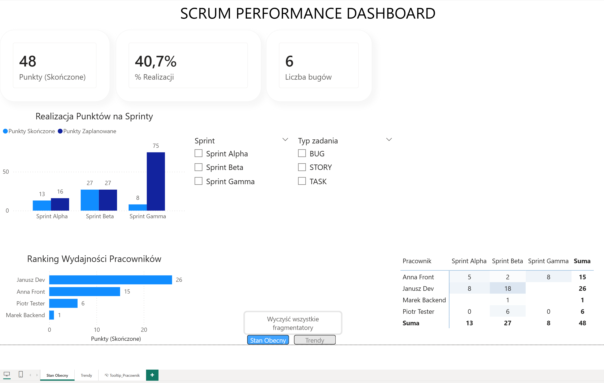
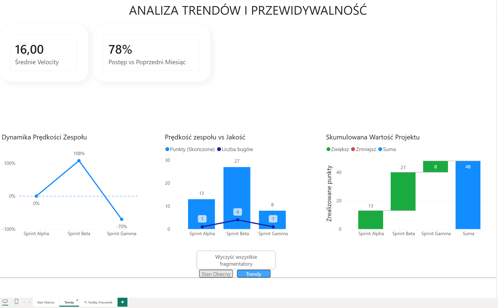

# Agile Performance Analytics: End-to-End SQL & Power BI Project 📊

## About the Project
This is an end-to-end data analytics project simulating a real-world Agile/Scrum environment. The goal is to monitor team performance, code quality, and workload distribution by extracting raw, unstructured data from a Jira-like system and transforming it into an interactive executive dashboard.

This project solves a common business problem: *"How to measure and visualize team efficiency when raw ticket data is unstructured?"*

## 🛠️ Technologies & Techniques Demonstrated
**1. **Database:** MS SQL Server (T-SQL)**
* **Advanced Analysis:** Window Functions (`LAG`, `RANK`), CTEs (`WITH`).
* **Data Cleaning:** `COALESCE`, `TRIM`, `UPPER`, `CAST`.
* **Data Aggregation:** `GROUP BY`, `HAVING`, `CASE WHEN`, `UNION ALL`.

**2. Business Intelligence & Visualization (Power BI)**
* **Data Modeling:** Building a Schema with a dedicated Calendar table.
* **DAX (Data Analysis Expressions):** Time Intelligence, `CALCULATE`, Measure branching.
* **UX/UI Design:** Building an interactive, two-page dashboard with Slicers, Tooltips, and KPI cards.

## Key Reports & KPIs 📈
The `project_analysis.sql` script generates the following insights:
1.  **Sprint Velocity:** Total Story Points delivered in each sprint.
2.  **Performance Trend:** Month-over-Month comparison using Window Functions to track velocity changes.
3.  **Quality Assurance (Bug Ratio):** Percentage of bugs vs. new features delivered.
4.  **Workload Analysis:** Employee ranking based on delivered value.

## 🎨 Dashboard Preview (Power BI)

### View 1: Current Status & Team Performance

### View 2: Trends & Predictability 

*(Note: Download the `.pbix` file from this repository to interact with the dashboard, slicers, and tooltips).*

## How to run? (SQL) ▶️
Copy the content of `project_analysis.sql` into any SQL editor (e.g., Azure Data Studio or SSMS) and execute the script. It will automatically create the table structure and populate it with sample data for analysis.

---
*Author: Michał Kośka*
